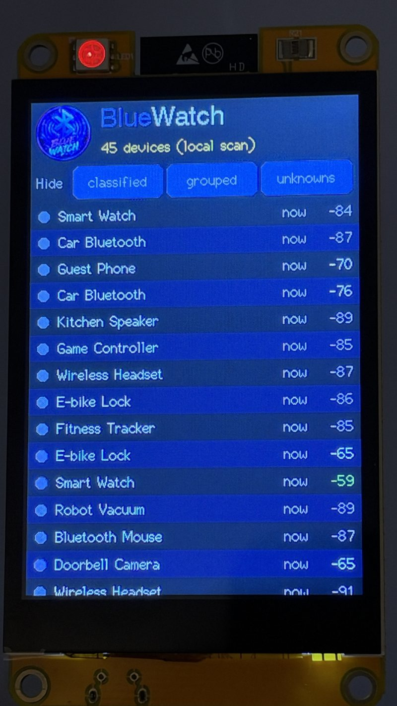
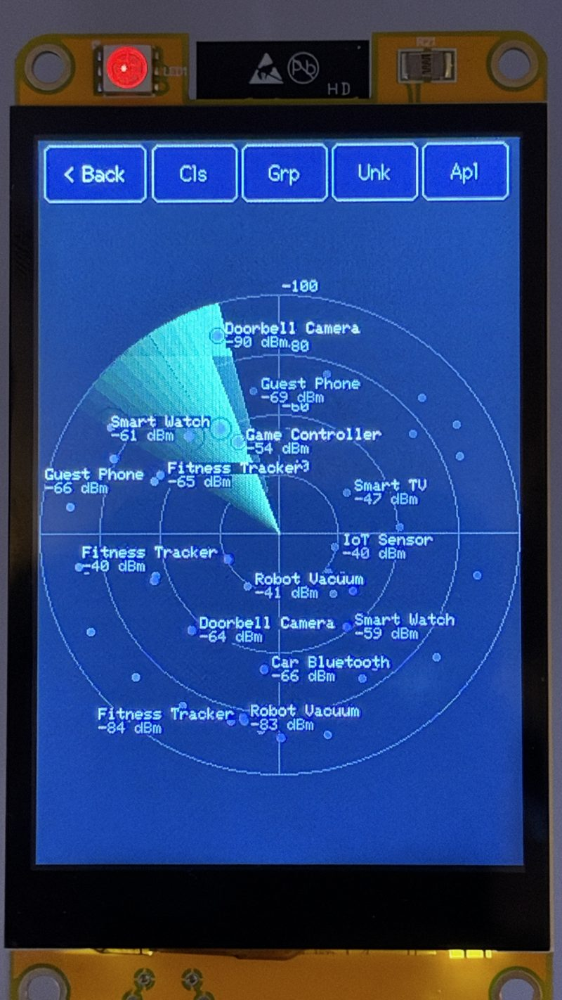

# BlueWatch CYD Radar

A standalone display for [BlueWatch](https://github.com/PolarPatch/BlueWatch) on
a "Cheap Yellow Display" board — a scrollable device list and a live signal
radar, no PC needed once it's flashed.

Main board: **ESP32-2432S028** (2.8", 240x320 portrait, ST7789 + XPT2046
resistive touch) — the more common, cheaper CYD. Also supported: the
**ESP32-3248S035C** (3.5", 320x480 portrait, ST7796 + GT911 capacitive
touch). It talks to a BlueWatch server over Wi-Fi and shows what BlueWatch is
seeing right now — and if no server is configured or reachable, it scans
Bluetooth itself and shows that instead (see **Standalone mode** below).

> The screenshots below use the board's built-in demo mode (`-demo` build,
> see below): every name shown is a generic placeholder ("Guest Phone",
> "Kitchen Speaker", ...), not a real nearby device.

## Screenshots

<p float="left">
  
  
</p>

*Device list, with the three Hide toggles at the top and a colour dot per
device type. This board was showing "(local scan)" — standalone mode — at
the time, not a BlueWatch server.*

*Radar view, opened by tapping the logo: sweeping beam, signal-strength
rings, and the four filter toggles (Cls / Grp / Unk / Apl) in place of a
device count.*

## What it does

- **Device list.** Devices seen recently (last 15 minutes by default — see
  `LIST_WINDOW_SECONDS`), newest first, scrollable, up to 100 rows. Each row
  shows a colour dot for the device type, name, signal strength and how long
  ago it was last seen.
- **Filters.** Three toggles at the top of the list — Hide classified, Hide
  grouped, Hide unknowns — matching BlueWatch's own dashboard filters. The
  radar has its own four, in its top bar — Cls / Grp / Unk / Apl (the last
  one hides Apple devices). Both remembered across restarts.
- **Device details.** Long-press (about 0.6 s) any row to open its detail
  card: address, vendor, proximity, signal, sightings, first/last seen,
  watched, notes, plus the **Live Signal** (last 15 minutes) and **Signal
  History** (7 days) graphs, scrollable, redrawn from BlueWatch's own data.
- **Radar.** Tap the BlueWatch logo to open a live radar view: a sweeping
  beam, devices coloured by type, an afterglow trail, and small labels
  (name + dBm) on the strongest, watched or alerting devices. Distance from
  the centre is signal strength — same idea as BlueWatch's own `/radar`
  page. The angle is derived from each device's address, so a given device
  always sits at the same spot.
- **Standalone mode.** No BlueWatch server configured (leave `WIFI_SSID`
  empty in `config.h`), or one that stops answering for a few seconds falls
  back to the board's own NimBLE scan automatically, and switches back the
  moment the server answers again. The header shows "(local scan)" in gold
  while it's in this mode. It has its own small on-device classifier
  (trackers, Flipper Zero, camera glasses, fitness/audio gear); everything
  else the board doesn't have a server for — vendor names, multi-day
  history, categories — simply isn't there in this mode.

## Requirements

- An ESP32-2432S028 or ESP32-3248S035C board (~$15-20 either way, sold as a
  "Cheap Yellow Display").
- Optional but recommended: a [BlueWatch](https://github.com/PolarPatch/BlueWatch)
  server on the same network, built from a version that has the
  `/api/display`, `/api/display/device` and `/api/display/radar` endpoints
  (added after v0.1.4 — check the BlueWatch repo's commit history if you're
  unsure). Without one, the board still works in standalone mode.
- [PlatformIO](https://platformio.org/) (CLI or the VS Code extension).

## Setup

1. Clone this repo:
   ```sh
   git clone https://github.com/PolarPatch/BlueWatch-CYD-Radar
   cd BlueWatch-CYD-Radar
   ```
2. Copy the config template and edit it:
   ```sh
   cp src/config.example.h src/config.h
   ```
   Set `WIFI_SSID`, `WIFI_PASS`, and `BW_HOST`/`BW_PORT` to your BlueWatch
   server's address — or leave `WIFI_SSID` empty for standalone-only.
   `config.h` is gitignored, since it holds your Wi-Fi password.
3. Plug the board in over USB-C and build/flash the board you have:
   ```sh
   pio run -e cyd-2432s028 -t upload         # 2.8" (default: plain `pio run` also works)
   pio run -e cyd-3248s035c -t upload        # 3.5"
   ```
   The first build pulls in LovyanGFX, ArduinoJson and NimBLE-Arduino; after
   that it's incremental. If PlatformIO picks the wrong serial port,
   uncomment and set `upload_port`/`monitor_port` in `platformio.ini`.
4. On first boot the screen shows "connecting to Wi-Fi..." and then the
   device count once it reaches BlueWatch (or "(local scan)" if it falls
   back to standalone). This is the device list. **Tap the BlueWatch logo,
   top left, to open the radar** — there's no button for it, only the logo.
   Tap "< Back", top left of the radar, to return to the list.

If colours look inverted, the display is upside down, or touches land in the
wrong place, adjust `TFT_INVERT`, `TFT_ROTATION`, the `TOUCH_*` flags and (on
the 2.8" board) `TOUCH_CAL_*` in `config.h` and re-flash.

### Troubleshooting other CYD panels

There are, by every account, dozens of panel/wiring variants sold under the
same "ESP32-2432S028" part number — this project can't know which one a
given board is. Every knob that turned out to matter for the one it was
actually built and tested against is a `config.h` define, so a different
unit is a config edit and a reflash, not a code change. Symptom → what to
try, roughly in the order to try them:

| What you see | Try |
|---|---|
| Picture stays mirrored no matter which of the 4 `TFT_ROTATION` values you use | `CYD_PANEL_ILI9341` — this board ships with either an ST7789 (the default here) or an ILI9341 panel controller, and using the wrong one looks exactly like a rotation bug that no rotation value fixes. |
| Right orientation and colours, but content is clipped on one edge / a whole column of buttons is cut off | The panel isn't reporting 240x320 — check `PANEL_OFFSET_ROTATION`; if you're on a driver/wiring this project hasn't seen, that dimension logic may need a closer look (open an issue with a photo). |
| Colours look swapped (red ↔ blue) even with `TFT_INVERT` toggled both ways | `PANEL_RGB_ORDER` |
| Orientation is off by a fixed amount that no `TFT_ROTATION` value corrects | `PANEL_OFFSET_ROTATION` (and `TOUCH_OFFSET_ROTATION` to match, so taps still line up) |
| Touches land in the wrong place even after `TOUCH_CAL_*` and `TOUCH_FLIP_*` | `TOUCH_OFFSET_ROTATION` |
| Display glitches, noise, or garbled regions | Lower `PANEL_SPI_FREQ_WRITE` (try 40000000) |
| Want landscape instead of portrait | `SCREEN_LANDSCAPE 1` — then re-find `TFT_ROTATION` by trying 0/1/2/3 again; there's no single rotation value that means "landscape" across panel batches. |

The defaults for all of these are copied from LovyanGFX's own autodetect
entry for this exact board (`board_Sunton_ESP32_2432S028` in
`LGFX_AutoDetect_ESP32_all.hpp`), not guessed — see the comments at the top
of `include/board_2432s028.h` for the source and the reasoning behind each
one.

### Test builds

Two extra environments per board, not meant to stay flashed long-term:

- `cyd-<board>-standalone-test` forces standalone mode (own BLE scan only)
  regardless of `config.h`, to check it works without touching your real
  Wi-Fi/server settings.
- `cyd-<board>-demo` replaces every name with a generic placeholder and
  zeroes the address shown in Device Details — used for the screenshots in
  this README, and safe for taking your own.

## Hardware notes

Both boards run portrait; the 2432S028 is narrower (240 vs 320 px), not
shorter, so it reuses almost the same layout at a smaller width. Screen
driver, touch driver and pin mapping live in a per-board header
(`include/board_2432s028.h`, `include/board_3248s035c.h`), picked by a build
flag in `platformio.ini`.

- **2432S028** (ST7789 + XPT2046): this exact board part number ships with
  either an ST7789 or an ILI9341 panel controller depending on the batch —
  this one turned out to be ST7789. Display on `HSPI_HOST` (SCLK 14, MOSI 13,
  MISO 12, DC 2, CS 15, backlight 21), touch on its own *software* SPI bus
  (SCLK 25, MOSI 32, MISO 39, CS 33) via LovyanGFX's built-in XPT2046 driver.
  Pin mapping, the panel's `offset_rotation` and the touch calibration range
  are taken from LovyanGFX's own verified autodetect entry for this board
  (`board_Sunton_ESP32_2432S028`) rather than guessed. If your unit turns out
  to be the ILI9341 variant instead, `include/board_2432s028.h` documents
  what changed switching between them.
- **3248S035C** (ST7796 + GT911): display on `SPI2_HOST` (SCLK 14, MOSI 13,
  MISO 12, DC 2, CS 15, backlight 27), touch (GT911) on I2C (SDA 33, SCL 32,
  INT 21, RST 25, address `0x5D`), read directly rather than through a
  library — the common Arduino GT911 drivers didn't talk to this particular
  board's wiring reliably in testing.

## Status

Working, tested against both boards and one BlueWatch server, including
standalone mode and the fallback between the two. Not yet tested against
multiple simultaneous screens or a BlueWatch server with a very large device
list beyond the default 15-minute window.

## License

MIT — see [LICENSE](LICENSE). Uses
[LovyanGFX](https://github.com/lovyan03/LovyanGFX) (MIT),
[ArduinoJson](https://github.com/bblanchon/ArduinoJson) (MIT) and
[NimBLE-Arduino](https://github.com/h2zero/NimBLE-Arduino) (Apache-2.0) as
library dependencies (not vendored, pulled in by PlatformIO).
